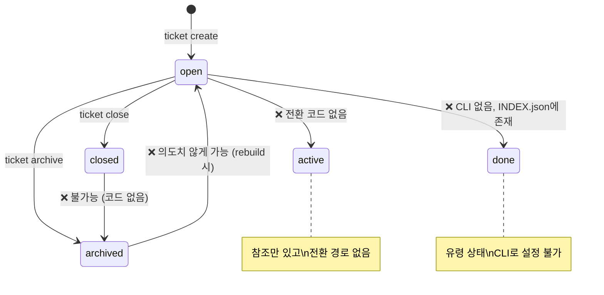
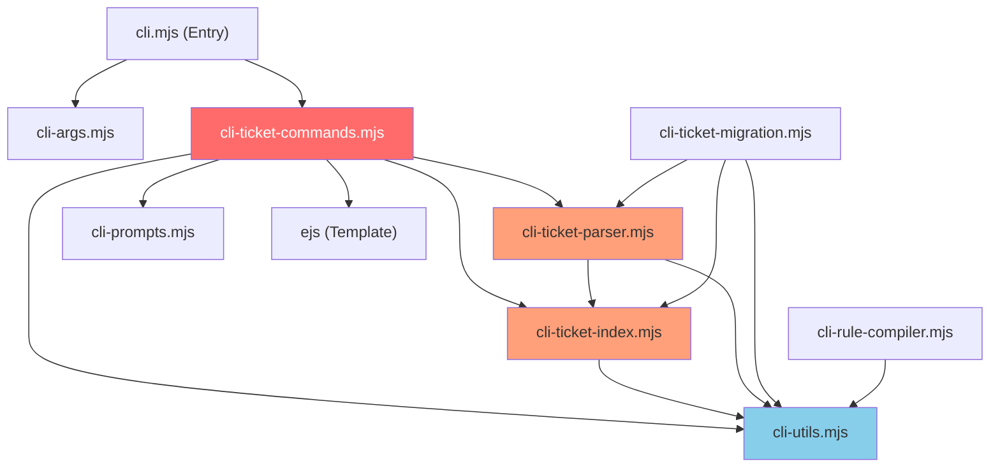

# DeukAgentRules 티켓 발급 로직 및 워크플로우 심층분석

> 분석 범위: `scripts/cli-ticket-*.mjs`, `cli-utils.mjs`, `cli-args.mjs`, `AGENTS.md`, `TICKET_TEMPLATE.md`
> 분석일: 2026-04-26

---

## 1. Executive Summary

현재 코드베이스에서 **7개 카테고리, 19개 이상의 구조적 결함**을 확인했어요. 가장 심각한 문제는 **티켓 상태 머신의 부재**, **INDEX.json과 RAG의 극심한 불일치(48 vs 778)**, 그리고 **검증 없는 상태 전이**에요.

---

## 2. 발견된 구조적 결함 (Severity 순)

### CAT-A: 티켓 상태 머신 (State Machine) 부재 — **CRITICAL**

| # | 결함 | 위치 | 영향 |
|---|------|------|------|
| A1 | **상태 값이 하드코딩 문자열로 분산** | 전체 | `"open"`, `"active"`, `"closed"`, `"archived"`, `"done"` 5개 상태가 enum 없이 산재. `"done"` 상태는 INDEX.json에 실존하나 코드에서 처리하는 곳이 없음 |
| A2 | **유효 상태 전이 규칙 없음** | [cli-ticket-commands.mjs:227](file:///home/joy/workspace/DeukAgentRules/scripts/cli-ticket-commands.mjs#L227) | `close`는 아무 상태에서나 `closed`로 전환 가능. `archived → closed` 같은 비논리적 전이를 막지 않음 |
| A3 | **`open` vs `active` 구분이 모호** | [cli-ticket-index.mjs:100-101](file:///home/joy/workspace/DeukAgentRules/scripts/cli-ticket-index.mjs#L100-L101) | `syncActiveTicketId`에서 `active` 먼저, 없으면 `open`을 찾지만, `active`로 전환하는 코드 경로가 **하나도 없음**. 사실상 dead code |
| A4 | **상태 전이 로그/이력 없음** | 전체 | 누가, 언제, 왜 상태를 바꿨는지 추적 불가. `updatedAt`만 갱신 |



---

### CAT-B: INDEX.json 무결성 — **CRITICAL**

| # | 결함 | 위치 | 영향 |
|---|------|------|------|
| B1 | **RAG 보고 active_ticket_count(778)와 실제(48) 극심한 불일치** | RAG Analytics | DeukContext가 인덱싱하는 대상과 실제 INDEX.json 엔트리 수가 16배 차이. RAG 의사결정 신뢰도 완전 훼손 |
| B2 | **중복 엔트리 방지 로직 없음** | [cli-ticket-parser.mjs:223-236](file:///home/joy/workspace/DeukAgentRules/scripts/cli-ticket-parser.mjs#L223-L236) | `appendTicketEntry`가 동일 ID 중복 체크 없이 배열 앞에 삽입. 같은 topic으로 재생성 시 중복 누적 |
| B3 | **`_corrupt` 플래그 제어 불충분** | [cli-ticket-index.mjs:38-41](file:///home/joy/workspace/DeukAgentRules/scripts/cli-ticket-index.mjs#L38-L41) | JSON 파싱 실패 시 `_corrupt: true`를 설정하나, 이후 `rebuildTicketIndexFromTopicFilesIfNeeded`에서는 이 플래그를 확인하지 않고 `writeTicketIndexJson`을 호출. corrupt 데이터 위에 덮어쓸 수 있음 |
| B4 | **rebuild 시 파일/인덱스 상태 역전** | [cli-ticket-parser.mjs:135](file:///home/joy/workspace/DeukAgentRules/scripts/cli-ticket-parser.mjs#L135) | `archive/` 디렉토리에 없지만 `existing.status === "archived"`인 엔트리를 `"open"`으로 되돌림. 아카이브 후 rebuild하면 상태가 롤백됨 |

---

### CAT-C: 티켓 생성 로직 (Create Flow) 결함 — **HIGH**

| # | 결함 | 위치 | 영향 |
|---|------|------|------|
| C1 | **`--ref` 경로의 INDEX 등록 누락** | [cli-ticket-commands.mjs:85-88](file:///home/joy/workspace/DeukAgentRules/scripts/cli-ticket-commands.mjs#L85-L88) | `--ref`로 생성 시 `resolveReferencedTicketPath`만 호출하고 `appendTicketEntry`를 건너뜀. INDEX.json에 등록되지 않는 유령 티켓 생성 |
| C2 | **Phase 0 검증이 MCP 존재 여부만 체크** | [cli-ticket-commands.mjs:33-37](file:///home/joy/workspace/DeukAgentRules/scripts/cli-ticket-commands.mjs#L33-L37) | `isMcpActive`는 `.mcp.json` 파일 존재 + `deuk-agent-context` 키 존재만 확인. SSE ping이 실패해도 stdio 방식이면 `true` 반환. 실제 MCP 프로세스 alive 검증이 아님 |
| C3 | **Frontmatter에 `status`, `group`, `project` 등 핵심 메타 미저장** | [TICKET_TEMPLATE.md](file:///home/joy/workspace/DeukAgentRules/bundle/templates/TICKET_TEMPLATE.md) | 템플릿이 `id`와 `title`만 frontmatter에 포함. `status`, `group`, `project`, `createdAt`, `evidence` 등이 누락되어 rebuild 시 메타데이터 유실 |
| C4 | **`evidence` 필드가 파일에도 INDEX에도 저장되지 않음** | [cli-ticket-commands.mjs:107-117](file:///home/joy/workspace/DeukAgentRules/scripts/cli-ticket-commands.mjs#L107-L117) | `meta.evidence`를 EJS에 전달하지만 템플릿에 `<%= meta.evidence %>` 슬롯이 없음. `appendTicketEntry`에도 `evidence` 필드 미포함 |

---

### CAT-D: 아카이브/Knowledge Distillation — **HIGH**

| # | 결함 | 위치 | 영향 |
|---|------|------|------|
| D1 | **`distillKnowledge`가 Section 이름을 하드코딩** | [cli-ticket-commands.mjs:268](file:///home/joy/workspace/DeukAgentRules/scripts/cli-ticket-commands.mjs#L268) | `"Design Decisions"`, `"Analysis & Constraints"`, `"Tasks"`, `"Done When"` 4개만 추출하지만, 현재 템플릿의 실제 섹션명은 `"Analysis & Constraints (Deep Review)"`, `"Strict Rules Check"` 등으로 불일치. 결과적으로 빈 knowledge.json 생성 |
| D2 | **아카이브 후 closed 상태 티켓 처리 경로 없음** | 전체 | `close → archive` 파이프라인이 없음. `close`된 티켓을 자동으로 archive 대상에 포함시키는 로직도, `closed` 상태에서 `archive` 호출 시 특별 처리도 없음 |
| D3 | **Knowledge JSON이 RAG에 인덱싱되지 않음** | `.deuk-agent/knowledge/` | `distillKnowledge`가 `.deuk-agent/knowledge/*.json`에 저장하지만, DeukContext의 인덱싱 대상은 `docs/plans/`와 `walkthroughs/`뿐. knowledge 디렉토리는 인덱싱 범위 밖 |

---

### CAT-E: CLI 인터페이스 및 인자 처리 — **MEDIUM**

| # | 결함 | 위치 | 영향 |
|---|------|------|------|
| E1 | **`ticket use --latest`가 정렬 기준에 의존** | [cli-ticket-commands.mjs:248](file:///home/joy/workspace/DeukAgentRules/scripts/cli-ticket-commands.mjs#L248) | `index.entries[0]`을 반환하는데, rebuild 시점에 따라 정렬 순서가 달라질 수 있음. `--latest`의 의미가 "가장 최근 생성"인지 "가장 최근 수정"인지 정의 불명확 |
| E2 | **`--active` 플래그가 파싱되지 않음** | [cli-args.mjs](file:///home/joy/workspace/DeukAgentRules/scripts/cli-args.mjs) | `ticket list --active`를 `parseTicketArgs`에서 파싱하는 코드 없음. `runTicketList`에서 `opts.active`를 참조하나 항상 `undefined` |
| E3 | **`--force` 플래그가 ticket 명령에서 파싱되지 않음** | [cli-args.mjs](file:///home/joy/workspace/DeukAgentRules/scripts/cli-args.mjs) | `writeTicketIndexJson`이 `opts.force`로 corrupt 오버라이드를 지원하나, `parseTicketArgs`에 `--force` 매핑 없음 |

---

### CAT-F: 테스트 커버리지 — **MEDIUM**

| # | 결함 | 위치 | 영향 |
|---|------|------|------|
| F1 | **티켓 관련 테스트가 0개** | `scripts/tests/` | `cli-utils.test.mjs` 하나만 존재하며, `cli-ticket-commands.mjs`, `cli-ticket-parser.mjs`, `cli-ticket-index.mjs`에 대한 통합/단위 테스트가 전무 |
| F2 | **E2E 워크플로우 테스트 없음** | - | `create → close → archive` 전체 라이프사이클을 검증하는 테스트가 없어 회귀 탐지 불가 |

---

### CAT-G: AGENTS.md 워크플로우 규약 vs 실제 구현 불일치 — **HIGH**

| AGENTS.md 규약 | 실제 구현 | Gap |
|---|---|---|
| Phase 0: RAG Research 필수 | `--skip-phase0` + `--evidence` 있으나, evidence가 저장/검증되지 않음 | evidence 휘발 |
| Phase 2: 파일 수정마다 RAG 검증 | CLI에 RAG 검증 훅 없음 | 에이전트 자율에 의존 |
| Phase 3: `synthesize_knowledge` 최종 검증 | CLI에 검증 단계 없음 | 에이전트 자율에 의존 |
| Phase 4: Potential Issue Table → 후속 티켓 | `--chain` 옵션 존재하나 자동화 아님 | 수동 의존 |
| Phase 5: `ticket archive` → 지식 보존 | `distillKnowledge` 존재하나 섹션명 불일치로 빈 결과 | 사실상 미작동 |
| Ticket Finding: `ticket use --latest` | 동작하나 `--path-only` 출력이 `opts.cwd` 기반이라 상위 디렉토리에서 실행 시 잘못된 경로 | 경로 신뢰성 이슈 |

---

## 3. 심각도 매트릭스

```
┌────────────────────────────────────┬──────────────┬───────────┐
│ Issue                              │ Severity     │ Effort    │
├────────────────────────────────────┼──────────────┼───────────┤
│ A1-A4: State machine 부재          │ 🔴 CRITICAL  │ M (2-3d)  │
│ B1: RAG/INDEX 불일치               │ 🔴 CRITICAL  │ S (1d)    │
│ B2-B4: INDEX 무결성                │ 🔴 CRITICAL  │ M (2d)    │
│ C1: --ref INDEX 미등록             │ 🟡 HIGH      │ XS (2h)   │
│ C2: Phase 0 검증 허점              │ 🟡 HIGH      │ S (4h)    │
│ C3-C4: 템플릿/evidence 누락        │ 🟡 HIGH      │ S (4h)    │
│ D1-D3: Knowledge distillation      │ 🟡 HIGH      │ M (1-2d)  │
│ E1-E3: CLI 인자 처리               │ 🟠 MEDIUM    │ S (4h)    │
│ F1-F2: 테스트 부재                 │ 🟠 MEDIUM    │ L (3-5d)  │
│ G: AGENTS.md vs 구현 불일치        │ 🟡 HIGH      │ L (3d)    │
└────────────────────────────────────┴──────────────┴───────────┘
```

---

## 4. 권장 조치 (Priority Order)

### Phase 1: State Machine + INDEX Integrity (CRITICAL, 먼저)

1. **`TicketStatus` 열거형 도입** — `cli-utils.mjs`에 유효 상태와 전이 규칙을 정의하는 상수 객체 추가
2. **`validateStatusTransition(from, to)` 가드 함수** — 모든 상태 변경 경로에 삽입
3. **`appendTicketEntry` 중복 방지** — ID 기반 dedup 로직 추가
4. **`_corrupt` 전파 차단** — rebuild 진입 시 corrupt 체크 추가
5. **RAG active_ticket_count 정합성** — DeukContext 인덱서가 INDEX.json을 직접 파싱하도록 수정하거나, 인덱싱 범위 조정

### Phase 2: Create Flow + Template (HIGH)

6. **TICKET_TEMPLATE.md 확장** — `status`, `group`, `project`, `createdAt`, `evidence` frontmatter 슬롯 추가
7. **`--ref` 경로 INDEX 등록** — `runTicketCreate`에서 ref 분기에도 `appendTicketEntry` 호출
8. **`isMcpActive` 개선** — stdio 방식일 때 실제 프로세스 존재 확인 (`ps aux | grep deuk-agent-context`)

### Phase 3: Archive Pipeline + Knowledge (HIGH)

9. **`distillKnowledge` 섹션명 동기화** — 템플릿의 실제 섹션명과 일치하도록 수정
10. **Knowledge JSON → RAG 인덱싱** — DeukContext 설정에 `knowledge/` 디렉토리 추가
11. **`close → archive` 자동 체이닝 옵션** 추가

### Phase 4: CLI + Test (MEDIUM)

12. **`--active`, `--force` 플래그 파싱 추가**
13. **`cli-ticket-commands.test.mjs` 작성** — create/close/archive 라이프사이클 E2E
14. **`cli-ticket-parser.test.mjs` 작성** — rebuild, appendEntry, statusUpdate 단위 테스트

---

## 5. 참고: 코드 구조 의존성 맵



> [!CAUTION]
> `cli-ticket-commands.mjs`(465줄)와 `cli-utils.mjs`(492줄)가 가장 높은 결합도와 복잡도를 가지고 있어 리팩토링 시 regression risk가 큼. 반드시 테스트 우선 접근 필요.
