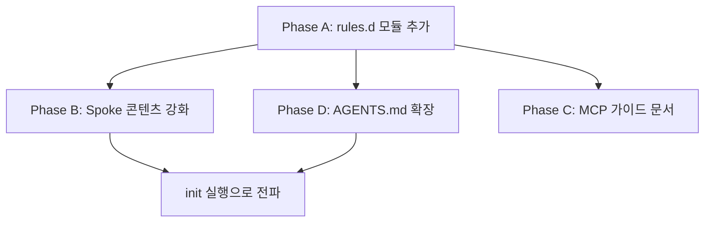

# 에이전트 플랫폼별 Agent/Plan 모드 심층 분석

> 티켓: #108 agent-platform-coexistence  
> 대상: Claude Code, GitHub Copilot, OpenAI Codex, Cursor  
> 비교 기준: 안티그라비티(Gemini) 대응 패턴

---

## 1. 현행 안티그라비티(Gemini) 대응 패턴 요약

현재 DeukAgentRules가 안티그라비티에 대해 구현한 공존 패턴:

| 영역 | 구현 상태 |
|------|-----------|
| Spoke 포인터 | `.agents/rules/deuk-agent.md` → `core-rules/AGENTS.md` |
| KI(Knowledge Item) 시스템 | KI 브릿지 규칙: Antigravity KI 정상 사용, `.deuk-agent/docs/`에 복제 의무 |
| Planning Mode | Plan Artifact 정상 생성 후 `.deuk-agent/docs/plans/`에 동기화 |
| Artifact 경로 | `brain/` 경로는 RAG 미인덱싱 → `.deuk-agent/docs/`로 복제 필수 |
| Workflow State | `set_workflow_context` MCP 호출로 DeukAgent 상태 동기화 |
| Conversation 참조 | `@conversation` mention + ticket `prevTicket`/`nextTicket` 동시 사용 |
| 전용 문서 | 없음 (공존 규칙이 `AGENTS.md`에 일반화되어 포함) |
| MCP 연동 가이드 | 없음 (Antigravity는 네이티브 MCP 지원) |

---

## 2. 플랫폼별 심층 분석

### 2.1 Claude Code (Anthropic)

#### 2.1.1 규칙 파일 체계

| 항목 | 상세 |
|------|------|
| **주 규칙 파일** | `CLAUDE.md` (프로젝트 루트) |
| **계층 구조** | 글로벌 (`~/.claude/CLAUDE.md`) → 프로젝트 루트 → 서브디렉터리 |
| **추가 규칙** | `.claude/rules/*.md` (모듈식 규칙 파일) |
| **설정 파일** | `~/.claude/settings.json` (모델, effortLevel, theme) |
| **MCP 설정** | `.mcp.json` (프로젝트 루트) |

#### 2.1.2 Plan Mode 동작

| 항목 | 동작 |
|------|------|
| **활성화** | `claude --permission-mode plan` 또는 `Shift+Tab` |
| **권한** | 파일 읽기, 검색, 분석만 가능. **편집/명령 실행 불가** |
| **산출물** | 구조화된 마크다운 계획서 (터미널 내 직접 출력) |
| **승인 흐름** | 계획 검토 → `Ctrl+G`로 편집 → 실행 모드로 전환 |
| **Auto-Accept** | 별도 모드로 존재 (신뢰된 배치 작업용) |

#### 2.1.3 아티팩트/지식 시스템

- **CLAUDE.md**: 세션 간 영구 지침 (프로젝트의 "교범")
- **세션 메모리**: 세션 간 상태 미유지 → CLAUDE.md에 모든 중요 규칙 기술 필수
- **네이티브 아티팩트**: 별도 artifact 시스템 없음. 터미널 내 직접 파일 생성/편집
- **MCP**: `.mcp.json` 기반. `claude mcp add` CLI 지원

#### 2.1.4 현재 DeukAgentRules 대응 상태

| 항목 | 상태 | 갭 |
|------|------|-----|
| Spoke 포인터 | ✅ `.claude/rules/deuk-agent.md` | 포인터만 있고 Claude-specific 지침 부재 |
| Plan Mode 브릿지 | ❌ | Claude Plan Mode에서 생성된 계획서의 `.deuk-agent/docs/` 복제 규칙 없음 |
| MCP 연동 가이드 | ✅ `docs/claude-code-mcp-setup.md` | 존재하지만 AGENTS.md에 참조 없음 |
| `rules.d` 모듈 | ❌ | Claude 전용 co-existence 규칙 모듈 없음 |
| 세션 메모리 한계 대응 | ❌ | 세션 간 상태 미유지 특성에 대한 가이드라인 없음 |

---

### 2.2 GitHub Copilot

#### 2.2.1 규칙 파일 체계

| 항목 | 상세 |
|------|------|
| **주 규칙 파일** | `.github/copilot-instructions.md` (레포지토리 전역) |
| **계층 구조** | 단일 레벨 (레포지토리 전역만) |
| **모듈식 규칙** | `.github/instructions/**/*.instructions.md` (파일/패턴 스코프) |
| **호환 포맷** | `AGENTS.md` (루트 또는 중첩), `CLAUDE.md`, `GEMINI.md` 도 인식 |
| **MCP 설정** | `.vscode/mcp.json` (VS Code 에이전트 모드) |

#### 2.2.2 Agent Mode / Plan Mode 동작

| 항목 | 동작 |
|------|------|
| **Agent Mode** | VS Code 내 Copilot Chat → Agent 모드. 코드베이스 분석, 멀티파일 편집, 터미널 실행 |
| **Plan Mode** | Agent 내부에서 자동 생성. 고수준 로드맵 → 검토/수정 → 승인 후 실행 |
| **산출물** | VS Code 내 diff view로 직접 제시 |
| **파일 참조** | `#file` 컨텍스트로 명시적 파일 지정 |
| **자기 교정** | 빌드/테스트 실행 → 에러 시 자동 재시도 루프 |

#### 2.2.3 아티팩트/지식 시스템

- **네이티브 아티팩트**: 없음. diff를 직접 적용
- **계획 저장**: Agent가 내부적으로 계획을 생성하지만 파일로 자동 저장하지 않음
- **MCP**: VS Code MCP 서버 지원 (`.vscode/mcp.json`)
- **지식 시스템**: instructions 파일 기반 (세션 간 학습 없음)

#### 2.2.4 현재 DeukAgentRules 대응 상태

| 항목 | 상태 | 갭 |
|------|------|-----|
| Spoke 포인터 | ✅ `.github/copilot-instructions.md` | 포인터만 있고 Copilot Agent 모드 전용 지침 부재 |
| 모듈식 규칙 | ❌ | `.github/instructions/` 활용 없음 |
| Plan 브릿지 | ❌ | Copilot Agent 계획 산출물 동기화 규칙 없음 |
| MCP 연동 | ❌ | `.vscode/mcp.json` 설정 가이드 없음 |
| `rules.d` 모듈 | ❌ | Copilot 전용 co-existence 규칙 없음 |

---

### 2.3 OpenAI Codex (CLI)

#### 2.3.1 규칙 파일 체계

| 항목 | 상세 |
|------|------|
| **주 규칙 파일** | `AGENTS.md` (프로젝트 루트, 업계 표준) |
| **계층 구조** | 글로벌 (`~/.codex/AGENTS.md`) → 프로젝트 루트 → CWD 방향 순차 병합 |
| **전역 설정** | `~/.codex/config.toml` (개인 설정) |
| **오버라이드** | `AGENTS.override.md` (개인 오버라이드) |
| **MCP 설정** | `.mcp.json` 또는 `~/.codex/` 내 설정 |

#### 2.3.2 Agent Mode / Sandbox

| 항목 | 동작 |
|------|------|
| **Agent Mode** | 기본 작동 모드 (goal-oriented, 자율 실행) |
| **Sandbox 레벨** | `read-only` / `workspace-write` (기본) / `danger-full-access` |
| **Plan Mode** | 별도 Plan Mode 없음. 에이전트가 내부적으로 계획 → 실행 → 검증 루프 |
| **자기 검증** | AGENTS.md의 테스트 명령을 자동 실행하여 결과 검증 |

#### 2.3.3 아티팩트/지식 시스템

- **AGENTS.md**: 유일한 영구 지침 메커니즘. 코드처럼 관리 권장
- **네이티브 아티팩트**: 없음. 직접 파일 수정/생성
- **세션 로그**: `~/.codex/log/` 에 JSONL 형식 자동 저장
- **Instruction 확인**: `codex --ask-for-approval never "List instruction sources"` 로 확인 가능

#### 2.3.4 현재 DeukAgentRules 대응 상태

| 항목 | 상태 | 갭 |
|------|------|-----|
| Spoke 포인터 | ✅ `.codex/AGENTS.md` | 포인터만 있음 |
| Global Codex Sync | ✅ `syncGlobalCodexInstructions()` | `~/.codex/AGENTS.md`에 글로벌 포인터 동기화 |
| Sandbox 레벨 가이드 | ❌ | 권장 sandbox 레벨 (`workspace-write`) 안내 없음 |
| Plan 브릿지 | ❌ | Codex는 Plan Mode가 없으나, TDW Phase 1 강제에 대한 Codex-specific 가이드 없음 |
| `rules.d` 모듈 | ❌ | Codex 전용 co-existence 규칙 없음 |

---

### 2.4 Cursor IDE

#### 2.4.1 규칙 파일 체계

| 항목 | 상세 |
|------|------|
| **주 규칙 파일** | `.cursor/rules/*.mdc` (MDC 포맷) |
| **레거시** | `.cursorrules` (단일 파일, 더 이상 권장하지 않음) |
| **포맷** | YAML frontmatter + Markdown 본문 |
| **활성화 모드** | `alwaysApply: true` / `globs` 패턴 / `description` 기반 자동 감지 / 수동 `@rule-name` |
| **MCP 설정** | `.cursor/mcp.json` |

#### 2.4.2 Agent Mode / Plan Mode 동작

| 항목 | 동작 |
|------|------|
| **Agent Mode** | Chat 내 Agent 탭. 코드베이스 분석, 멀티파일 편집, 터미널 실행 |
| **Plan Mode** | `Shift+Tab`으로 활성화. 연구 → 질문 → 구조화된 계획 생성 |
| **계획 저장** | `.cursor/plans/` 에 저장 가능 ("Save to Workspace") |
| **Build 실행** | 계획 검토 후 "Build" 버튼으로 실행 |
| **MDC 소비** | Agent가 `.mdc` 규칙을 자동 로딩하여 일관성 유지 |

#### 2.4.3 아티팩트/지식 시스템

- **.mdc 규칙**: 모듈식, 패턴 기반 자동 활성화
- **Plan 아티팩트**: `.cursor/plans/` 에 저장 (소스 컨트롤 추적 가능)
- **MCP**: `.cursor/mcp.json` 기반
- **`@` 참조**: 규칙에서 다른 파일을 `@mention`으로 참조 가능

#### 2.4.4 현재 DeukAgentRules 대응 상태

| 항목 | 상태 | 갭 |
|------|------|-----|
| Spoke 포인터 | ✅ `.cursor/rules/deuk-agent.mdc` (MDC 포맷) | 포인터만 있고 Cursor Agent 전용 지침 부재 |
| Plan 아티팩트 브릿지 | ❌ | `.cursor/plans/` 산출물의 `.deuk-agent/docs/` 복제 규칙 없음 |
| MCP 연동 | ❌ | `.cursor/mcp.json` 설정 가이드 없음 |
| `rules.d` 모듈 | ❌ | Cursor 전용 co-existence 규칙 없음 |

---

## 3. 공통 갭 분석 (Gap Matrix)

| 기능 | Antigravity | Claude | Copilot | Codex | Cursor |
|------|:-----------:|:------:|:-------:|:-----:|:------:|
| Spoke 포인터 | ✅ | ✅ | ✅ | ✅ | ✅ |
| Plan Mode 브릿지 규칙 | ✅ | ❌ | ❌ | ❌ | ❌ |
| Artifact 경로 복제 규칙 | ✅ | ❌ | ❌ | ❌ | ❌ |
| MCP 연동 가이드 | N/A | ⚠️ | ❌ | ❌ | ❌ |
| `rules.d` 전용 모듈 | ❌ | ❌ | ❌ | ❌ | ❌ |
| 플랫폼-specific 문서 | ❌ | ⚠️ | ❌ | ❌ | ❌ |
| Spoke 콘텐츠 강화 | ❌ | ❌ | ❌ | ❌ | ❌ |

> ⚠️ = 부분적 존재 (있지만 불완전)

---

## 4. 개선 실행 계획

### Phase A: `rules.d` 플랫폼별 Co-existence 모듈 추가

각 플랫폼에 대한 조건부 주입 규칙 모듈을 `templates/rules.d/`에 추가한다.

#### A-1. `templates/rules.d/claude-coexistence.md`
```yaml
---
id: claude-coexistence
condition:
  spoke: claude
inject_target: ["AGENTS.md"]
---
```
**내용:**
- Claude Plan Mode 산출물 → `.deuk-agent/docs/plans/` 복제 의무
- 세션 간 상태 미유지 특성: 매 세션 시작 시 `CLAUDE.md` → `core-rules/AGENTS.md` 자동 참조
- `claude --permission-mode plan` 사용 시 TDW Phase 1과 자연스러운 매핑
- `.mcp.json` 설정 필수 (sonnet + high 권장)

#### A-2. `templates/rules.d/copilot-coexistence.md`
```yaml
---
id: copilot-coexistence
condition:
  spoke: copilot
inject_target: ["AGENTS.md"]
---
```
**내용:**
- Copilot Agent Mode 계획 → `.deuk-agent/docs/plans/` 복제 의무
- `#file` 참조로 `PROJECT_RULE.md` 및 `AGENTS.md` 명시적 지정 권장
- `.github/instructions/` 모듈 활용: `deuk-agent-workflow.instructions.md` 생성 고려
- `.vscode/mcp.json` MCP 연동 안내

#### A-3. `templates/rules.d/codex-coexistence.md`
```yaml
---
id: codex-coexistence
condition:
  spoke: codex
inject_target: ["AGENTS.md"]
---
```
**내용:**
- Codex의 Sandbox 레벨: `workspace-write` 권장 (TDW Phase 2와 매핑)
- `AGENTS.md` 계층 병합 순서: 글로벌 → 프로젝트 → CWD (DeukAgent Hub-Spoke와 자연 정합)
- Codex에 Plan Mode 부재 → TDW Phase 1을 AGENTS.md에 명시적으로 강제
- `~/.codex/AGENTS.md`의 글로벌 포인터 역할 명확화

#### A-4. `templates/rules.d/cursor-coexistence.md`
```yaml
---
id: cursor-coexistence
condition:
  spoke: cursor
inject_target: ["AGENTS.md"]
---
```
**내용:**
- Cursor Plan Mode 산출물 (`.cursor/plans/`) → `.deuk-agent/docs/plans/` 복제 의무
- MDC `description` 필드를 활용한 DeukAgent 규칙 자동 로딩 가이드
- `.cursor/mcp.json` MCP 연동 안내
- `@rule-name` 참조로 `deuk-agent.mdc` 수동 호출 가이드

### Phase B: Spoke 콘텐츠 강화

현재 모든 Spoke 포인터가 동일한 "This project follows..." 최소 내용만 포함한다. 각 플랫폼 특성에 맞는 핵심 지침을 Spoke에 인라인으로 추가한다.

#### B-1. `generateSpokeContent()` 확장 (`cli-init-commands.mjs`)

```javascript
function generateSpokeContent(spoke, bundleRoot) {
  const globalRulesPath = join(bundleRoot, "core-rules", "AGENTS.md");
  
  // 플랫폼별 핵심 인라인 지침
  const platformHints = {
    claude: `
## Quick Start for Claude Code
- Run \`claude --permission-mode plan\` for TDW Phase 1 (Plan).
- Switch to normal mode for TDW Phase 2 (Execute).
- Always copy plan artifacts to \`.deuk-agent/docs/plans/\`.
- Ensure \`.mcp.json\` is configured with \`sonnet\` + \`high\` effortLevel.
`,
    copilot: `
## Quick Start for Copilot Agent
- Use Agent Mode plan output as TDW Phase 1 material.
- Copy plan artifacts to \`.deuk-agent/docs/plans/\`.
- Reference \`PROJECT_RULE.md\` via \`#file\` for architecture context.
`,
    codex: `
## Quick Start for Codex
- Codex has no native Plan Mode. Create a ticket with Phase 1 before coding.
- Use \`workspace-write\` sandbox level for standard operations.
- Test commands in AGENTS.md are auto-executed by Codex for verification.
`,
    cursor: `
## Quick Start for Cursor Agent
- Use Plan Mode (\`Shift+Tab\`) for TDW Phase 1 planning.
- Save plans to \`.cursor/plans/\` AND \`.deuk-agent/docs/plans/\`.
- MDC rules in \`.cursor/rules/\` are auto-loaded by the agent.
`,
    antigravity: `
## Quick Start for Antigravity
- Use Planning Mode artifacts for TDW Phase 1.
- Copy artifacts from \`brain/\` to \`.deuk-agent/docs/\` for RAG indexing.
- KI (Knowledge Items) and @conversation mentions work alongside ticket chaining.
`
  };
  
  const hint = platformHints[spoke.id] || "";
  // ... 기존 content 생성 + hint 추가
}
```

### Phase C: 플랫폼별 MCP 설정 가이드 문서

#### C-1. `docs/copilot-mcp-setup.md` (신규)
- `.vscode/mcp.json` 설정 방법
- Copilot Agent Mode에서 MCP 도구 사용법

#### C-2. `docs/codex-mcp-setup.md` (신규)
- `.mcp.json` 또는 `~/.codex/` 설정 방법
- Sandbox 레벨과 MCP 도구 권한 관계

#### C-3. `docs/cursor-mcp-setup.md` (신규)
- `.cursor/mcp.json` 설정 방법
- MDC 규칙에서 MCP 도구 참조 방법

### Phase D: AGENTS.md 플랫폼별 Co-existence 섹션 확장

현재 `core-rules/AGENTS.md`의 "Agent Platform Co-existence Protocol"을 확장하여 플랫폼별 Plan Mode ↔ TDW Phase 매핑 표를 추가한다.

```markdown
### Platform → TDW Phase Mapping

| Platform | Plan Mode | TDW Phase 1 (Plan) | TDW Phase 2 (Execute) |
|----------|-----------|--------------------|-----------------------|
| Antigravity | Planning Mode | Plan Artifact → `.deuk-agent/docs/plans/` | Normal execution |
| Claude Code | `--permission-mode plan` | Read-only analysis → plan `.deuk-agent/docs/plans/` | Switch to Normal Mode |
| Copilot | Agent Mode (auto-plan) | Plan output → `.deuk-agent/docs/plans/` | Agent continues execution |
| Codex | N/A (no plan mode) | `ticket create` → manual Phase 1 | `workspace-write` sandbox |
| Cursor | Plan Mode (Shift+Tab) | `.cursor/plans/` + `.deuk-agent/docs/plans/` | "Build" execution |
```

---

## 5. 우선순위 및 의존성



| Phase | 우선순위 | 예상 영향 |
|-------|---------|----------|
| A (rules.d 모듈) | **P0** | 각 플랫폼에서 TDW 준수를 구조적으로 강제 |
| B (Spoke 강화) | **P0** | 에이전트가 최초 로딩 시 즉시 플랫폼별 핵심 지침 인지 |
| D (AGENTS.md 확장) | **P1** | 범용 규칙 문서에 매핑 표 추가 |
| C (MCP 가이드) | **P2** | 참고 문서 (필요 시 점진적 추가) |

---

## 6. 결정 요청

1. **`rules.d` 모듈의 조건부 주입 메커니즘**: 현재 `deukcontext-mcp.md`는 `condition.mcp` 키를 사용한다. 새 모듈은 `condition.spoke` 키를 추가해야 하는가? 아니면 기존 `detect()` 로직을 재사용하는가?

2. **Spoke 콘텐츠 인라인 지침 범위**: 최소한의 Quick Start만 포함할 것인가, 아니면 전체 co-existence 규칙을 Spoke에 인라인할 것인가? (토큰 비용 vs. 즉시성 트레이드오프)

3. **MCP 설정 가이드 우선순위**: Claude용은 이미 존재하므로 Copilot/Codex/Cursor를 즉시 추가할 것인가, 아니면 실제 사용 빈도에 따라 점진적으로 추가할 것인가?

4. **Copilot `.github/instructions/` 활용**: `.github/instructions/deuk-agent-workflow.instructions.md` 파일을 별도로 생성하여 Copilot의 모듈식 지침 시스템을 적극 활용할 것인가?
