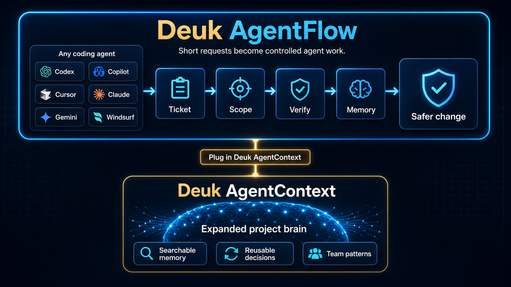

<div align="center">
  <br />
  
  <br />
  <h1>DeukAgentRules v3.3.3</h1>
  <p>
    <a href="https://www.npmjs.com/package/deuk-agent-rule"></a>
    <a href="https://www.npmjs.com/package/deuk-agent-rule"></a>
  </p>
  <p><b>AI coding agent guardrails for every repo</b></p>
  <p><i>Ticketed scope, verification, and memory for Codex, Copilot, Claude Code, Cursor, and more</i></p>
  <p>Part of the <a href="https://deukpack.app">Deuk Family</a> ecosystem.</p>
  <p><a href="README.ko.md">한국어</a> · <a href="README.md">English</a></p>
</div>

---

**DeukAgentRules** gives AI coding agents a shared way to work through tickets, scope contracts, verification, and durable project memory.

It is more than a prompt pack. It is a repository-level workflow layer that standardizes collaboration through the **Hub-Spoke Architecture** and a **Ticket-Driven Execution Model** while keeping `AGENTS.md`, Copilot instructions, Cursor rules, Claude skills, and related agent surfaces aligned.

Ticket management lives under `.deuk-agent/`, with active work tracked in `.deuk-agent/tickets/` and related docs, plans, and archive data kept alongside it.

> **Current readiness:**
> v3.3.3 is deployment-ready for agent-driven repositories. It is currently most reliable in **OpenAI Codex** and **GitHub Copilot** workflows. Cursor, Windsurf, Claude Code, and MCP remain supported through pointer-style integration, but they should be validated per workspace before rollout. MCP server registration is separate from `init`.

> **Architecture foundation:**
> We have officially deprecated monolithic `.cursorrules`. v3.0 introduces the **Hub-Spoke model** where `AGENTS.md` is the single source of truth, and IDE-specific rules act as thin entry-point pointers.

### 🗺️ Main Features & Architecture

DeukAgentRules brings four core capabilities to day-to-day AI engineering:

1. **Zero-Copy Hub-Spoke Architecture**
   - **Hub**: `AGENTS.md` acts as the global single source of truth.
   - **Spoke**: IDE-specific rules (like `.cursorrules`) or `PROJECT_RULE.md` act as thin pointers.
   - **Benefit**: Eliminates rule duplication, preventing conflicting instructions and context hallucination across different IDEs (Cursor, Copilot, Windsurf).

2. **Ticket-Driven Workflow (TDW)**
   - Guides work through a clear lifecycle: Plan → Execute → Verify → Archive.
   - Keeps changes connected to an active ticket in `.deuk-agent/tickets/`, so scope and progress stay visible.

3. **Platform Co-existence & Mode-Aware Workflow Gate**
   - Uses strong Agent Permission Contracts (APC) through a **Mode-Aware** workflow.
   - In **Plan Mode**, agents focus on analysis and planning artifacts before moving into approved execution.
   - Integrates with MCP Soft Gates to keep code changes aligned with the current ticket context.

4. **Zero-Token Knowledge Distillation**
   - When a ticket is archived, it is distilled into a zero-token summary and moved to `reports/`.
   - These reports are vectorized into DeukAgentContext, building a permanent Engineering Memory Engine without cluttering the agent's active context window.

### Why Not Just Instructions?

The agent tooling space already has useful building blocks: `AGENTS.md`, GitHub Copilot instructions, Cursor rules, Claude skills, agent launchers, and general LLM guardrail frameworks. DeukAgentRules is positioned one layer above plain instruction sync: it turns those surfaces into a ticketed repository workflow.

| Similar approach | What it helps with | DeukAgentRules adds |
|---|---|---|
| `AGENTS.md` open format | A predictable instruction file for coding agents | Ticket lifecycle, phase gates, verification, and archiveable memory |
| Copilot instructions / Cursor rules / Claude memory | Tool-specific guidance | One repo-owned workflow shared across agent clients |
| Claude or Copilot custom agents and skills | Reusable task playbooks | Skills route into scoped, ticketed execution instead of replacing the workflow |
| Agent launchers and harnesses | Running many coding agents from one place | Lifecycle control inside the repository, independent of the chosen agent |
| General LLM/MCP guardrails | Runtime policy checks for AI systems | Developer-facing work orders, scope contracts, Git-visible history, and closeout evidence |

Use DeukAgentRules when you want AI coding work to stay coordinated, reviewable, and easy to carry forward across sessions and teammates.

### Better Together With Karpathy-Style Skills

Karpathy-style skills are great at improving how an agent behaves inside a task. DeukAgentRules is great at making that task ticketed, scoped, verified, and remembered at the repository level.

Used together, skills can improve the quality of the move, while DeukAgentRules keeps the move connected to team workflow. The result is a better session and a better project record: behavior playbooks on the front end, ticket lifecycle and DeukAgentContext memory on the back end.

### What's Next

The next step is to make this workflow even easier to see and adopt: clearer first-run checks, compact CLI/RAG reminders for agents, stronger README/npm positioning, and companion surfaces that show active ticket, phase, open-ticket count, and DeukAgentContext memory status without asking teams to switch coding agents.

### 📚 Detailed Documentation
| Doc | Purpose |
|---|---|
| [docs/architecture.md](docs/architecture.md) | High-level system structure and visual infographics |
| [docs/how-it-works.md](docs/how-it-works.md) | Detailed CLI mechanics, initialization lifecycle, and file roles |
| [docs/principles.md](docs/principles.md) | Design philosophy: Hub-Spoke, Zero-Legacy, and Source Sovereignty |
| **Korean Docs** | [README.ko.md](README.ko.md) · [docs/architecture.ko.md](docs/architecture.ko.md) |

---

## 🛠️ Installation & Setup

### 1. Global Installation (Standard User)
To prevent `npx` cache issues and "Local Traps", a global installation is strictly required.

```bash
npm install -g deuk-agent-rule
deuk-agent-rule init
```

### 2. Local Source Development (Maintainer/Power User)
v3.0 introduces a **Global CLI Proxy**. If you are developing inside the `DeukAgentRules` workspace, the global command will automatically delegate execution to your local source.

```bash
cd ~/workspace/DeukAgentRules
sudo npm link
deuk-agent-rule init  # Routes to local scripts/cli.mjs automatically
```

If you primarily work in Codex or Copilot, this is the recommended day-to-day setup. Those clients currently have the smoothest behavior with the hub-spoke and ticket-driven workflow.

---

## 🎯 The Protocol Workflow

The workflow is governed by a **Ticket-Driven Execution Contract**.

1. **Scaffolding**: `init` deploys `.deuk-agent/templates/` and `AGENTS.md` (or local pointers like `PROJECT_RULE.md`).
2. **Ticketing (Plan Phase)**: `ticket create --topic feature-x` generates a bounded work order in `.deuk-agent/tickets/`. During this phase, agents operate in **Plan Mode** and are restricted from mutating files.
3. **Execution (Execute Phase)**: Once authorized, the AI agent reads the ticket, locks onto the **Target Submodule**, and executes code changes. MCP Soft Gates ensure that unauthorized modifications are blocked.
4. **Verification**: The agent performs a side-effect audit and convention (e.g., DC-DUP) check before closure.
5. **Archiving (Archive Phase)**: Completed tickets undergo Zero-Token Knowledge Distillation and move to `reports/` to build the **Engineering Memory Engine** via DeukAgentContext.

---

## ⚙️ CLI Reference

Delegate these to your AI agent via natural language prompts!

| Command | Description / Example Prompt |
|--------|------|
| `deuk-agent-rule init` | Synchronizes the rule Hub and Spoke pointers. <br>💬 *"Initialize project rules"* |
| `deuk-agent-rule ticket create` | Issues a new execution contract. Use `--summary` plus `--plan-body` for a one-pass Phase 1 ticket. <br>💬 *"Create ticket: refactor-ui with filled APC"* |
| `deuk-agent-rule ticket list` | Displays active work orders. <br>💬 *"Show active tickets"* |
| `deuk-agent-rule ticket archive` | Securely stores completed work. <br>💬 *"Archive ticket 068"* |
| `deuk-agent-rule skill list` | Shows first-party thin skills such as `safe-refactor`, `generated-file-guard`, and `context-recall`. |
| `deuk-agent-rule skill add --skill safe-refactor` | Installs a skill into the local registry without changing the TDW/APC authority model. |
| `deuk-agent-rule skill expose --platform claude` | Exposes installed skills as platform-specific thin wrappers. Supported MVP platforms: `claude`, `cursor`. |
| `deuk-agent-rule skill lint` | Audits skill files for duplicate workflow contracts and unsafe generated-file guidance. |

### Ticket File Git Hygiene

- Treat `.deuk-agent/tickets/**/*.md` and `INDEX*.json` as CLI-managed lifecycle artifacts.
- Do not commit a ticket body without the related index updates. The next session can restore the wrong active/archive state.
- After `ticket create` fails, do not create or repair ticket files manually.
- Do not flip ticket status by editing frontmatter directly. Use `ticket move`, `ticket close`, or `ticket archive`.
- `telemetry.jsonl` is usually operational log noise, so it is better left out of normal code commits unless your repo intentionally tracks it.
- When possible, commit completed work after `ticket archive` so the active/archive transition lands in one history step.

For more day-to-day examples, see [docs/how-it-works.md](docs/how-it-works.md).

---

## Related Ideas & Inspiration

DeukAgentRules shares the same concern as guideline-first projects like
[andrej-karpathy-skills](https://github.com/forrestchang/andrej-karpathy-skills):
AI coding agents often over-assume, over-engineer, and edit outside the requested scope.

Where prompt-level guideline files improve agent behavior inside one client,
DeukAgentRules adds a repository-level workflow layer: tickets, phase gates,
scoped permissions, verification, and archiveable engineering memory.

The first-party skill MVP keeps that boundary explicit: skills are short
`SKILL.md` playbooks for recurring failure patterns, while `core-rules/AGENTS.md`
remains the workflow authority. Use `skill add` and `skill expose` to make those
playbooks visible to Claude or Cursor without copying the full rule contract.

```bash
npx deuk-agent-rule init
npx deuk-agent-rule skill list
npx deuk-agent-rule skill add --skill safe-refactor
npx deuk-agent-rule skill expose --platform claude
```

---

### 🏷️ Keywords
`#AI-Orchestration` `#Agentic-Workflow` `#DeukFamily` `#Engineering-Intelligence` `#Zero-Legacy` `#High-Signal-Coding` `#AI-Protocol` `#CursorRules` `#CopilotInstructions` `#ClaudeCode` `#ClaudeMD` `#AgentsMD` `#AgentSkills` `#CodingAgent` `#AI-Guardrails` `#LLM-Control-Plane`
