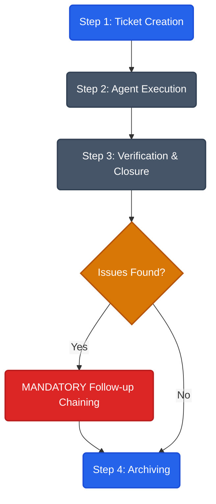

<div align="center">
  <br />
  <h1>DeukAgentRules</h1>
  <p>
    <a href="https://www.npmjs.com/package/deuk-agent-rule"></a>
    <a href="https://www.npmjs.com/package/deuk-agent-rule"></a>
  </p>
  <p><b>High-Signal Encoding & Rule Standardization Engine</b></p>
  <p>Part of the <a href="https://deukpack.app">Deuk Family</a> ecosystem.</p>
</div>

> A core module of the **Deuk Family**. Maximizes collaboration efficiency of AI agents through structured rules.

**npm package:** `deuk-agent-rule` · **CLI:** `deuk-agent-rule`

**Korean:** [README.ko.md](https://github.com/joygram/DeukAgentRules/blob/master/README.ko.md)

A **submodule-isolated collaborative framework** designed to be used alongside various coding agents such as Cursor, GitHub Copilot, Gemini / Antigravity, Claude, Windsurf, and JetBrains AI Assistant.
It standardizes project rules (`AGENTS.md`, `.cursor/rules`) and strongly prevents wasteful prompt token consumption and AI context hallucination through a **ticket-based workflow**.

> **🚀 Core Value:**
> Compresses the mandatory loaded context of approx. 1,500~2,000 tokens per session down to a mere 200~300 tokens. By isolating the AI to a specific **"Target Submodule"** using exact tickets (work orders), it prevents the AI from wandering through an entire monolithic repository.

### 📢 What's New in v2.4
In the latest v2.4 release, the **Dynamic Rule Assembly Engine** has been introduced. The script automatically detects your project environment (e.g., DeukRag MCP integration) and injects only the necessary context-aware rules into `AGENTS.md`.
The CLI ticketing system has also been upgraded: running `deuk-agent-rule ticket create` now automatically scaffolds design Plan documents and links them to the ticket, heavily reinforcing the Phase-based issue tracking workflow.

> **💡 RAG Engine Integration Guide (Coming Soon)**
> We are currently preparing an advanced integration manual and feature update. This will perfectly integrate these agent rules with our internal knowledge search engine **DeukRag (MCP)**, allowing your AI agent to automatically search past tickets and internal conventions to maximize its contextual awareness and problem-solving effectiveness!

---

## 🛠️ Getting Started (Workspace Initialization)

Since this CLI tool is used frequently across multiple repositories and submodules, a **global installation is highly recommended**.

```bash
npm install -g deuk-agent-rule
deuk-agent-rule init
```

> [!NOTE]
> **Global Install Permission Troubleshooting**:
> - **Linux/macOS**: Running `npm install -g` may result in `EACCES` permission errors. It is highly recommended to use a Node version manager (`nvm`, `fnm`, etc.) to bypass these constraints. If using the system Node installation, you may unavoidably need to use `sudo npm install -g deuk-agent-rule`.
> - **Windows**: If Node.js is installed in a system directory like `Program Files`, you must run your terminal (PowerShell/CMD) as an **Administrator** for the global installation to complete successfully.

### 💡 Why Global Installation?

> [!WARNING]
> **Submodule Local Installation STRICTLY FORBIDDEN**: Never install `deuk-agent-rule` locally (e.g., `npm install deuk-agent-rule`) inside your target consumer submodules. Doing so creates a "Local Trap" where `npx` prioritizes the outdated local `node_modules` over the globally installed latest version, leading to severe ticket formatting errors and logic mismatches.

1. **Preventing `npx` Cache & Local Trap Issues**: Running `npx deuk-agent-rule` relies on the local npm cache and `node_modules` resolution. If a stale version is present locally, it will silently hijack the execution. This has been proven to cause severe agent hallucinations or ticket formatting errors (e.g., missing hostname sequence IDs).
2. **Execution Speed**: The chatbot agent receives instant CLI responses without the overhead of `npx` checking for temporary package downloads.
3. **Cross-Repository Consistency**: It allows you to reliably apply the exact same version of the agent rules across various submodules and independent microservices in the Deuk Family ecosystem.

Upon initialization, interactive questions will ask for the project's **tech stack** and **agent tools in use**. Based on your selections, optimized markdown templates and rule files (`.cursor/rules/*`) will be automatically generated and synchronized.
- If you don't need to change the tech stack later, simply run `deuk-agent-rule init` to refresh the rules. (If not installed globally, you can fallback to `npx deuk-agent-rule init`).
- Suppress interactive prompts in CI or script environments by appending the `--non-interactive` flag.

### 🔄 Updating the Rules Package
When a new version of the agent rules or templates is released, you can sync the latest instructions to your project by updating the package and re-running `init`.
Since your previous configurations are saved (`.deuk-agent-rule.config.json`), using the `--non-interactive` flag will quietly and cleanly overwrite the obsolete rules with the latest ones without asking any questions.
```bash
npm install deuk-agent-rule@latest
deuk-agent-rule init --non-interactive
```

> [!TIP]
> **💡 Troubleshooting: Legacy Version Migration Failures**
> If you are migrating from a very old version and `init` repeatedly fails due to corrupted configurations or heavily modified template structures, the fastest fix is to perform a clean initialization using the `--clean` flag. **(This will not affect your existing tickets.)**
> ```bash
> deuk-agent-rule init --clean --interactive
> ```

---

## 🎯 The Ticket Workflow

Running `deuk-agent-rule init` deploys a **zero-touch scaffolding sandbox** at your workspace root, spawning two essential directories:

1. **`.deuk-agent-templates/` (Agent Templates)**: Houses the official blueprint (`TICKET_TEMPLATE.md`) dictating how AIs must process and report tasks. Committed alongside your source code to serve as the team's rulebook.
2. **`.deuk-agent-ticket/` (Ticket Execution Space)**: The covert space where volatile instructions (`TICKET-XXX.md`) are exchanged between agents and workers. (Automatically hidden by `.gitignore` to prevent security leaks and repository bloat).

### 💡 Workflow Overview


The optimal **4-Step AI Coding Sequence** utilizing these sandbox folders is as follows.

### [Step 1] Ticket Creation & Submodule Isolation
Do not issue scattered, unbounded commands to your AI. Narrowing the **context** via a clear ticket is strictly required to prevent astronomical costs and accidental code corruption.

```bash
deuk-agent-rule ticket create --topic ui-refactoring --group frontend --project DeukUI
```
This command instantly creates a templated `TICKET-ui-refactoring.md` file within the `.deuk-agent-ticket/` directory.

> [!IMPORTANT]
> **Filling the Ticket (CRITICAL)**: The newly created ticket already contains **YAML Front Matter** (`--- id: ... ---`). **DO NOT** overwrite the entire file when adding your plan. ALWAYS append your content below the header or use partial file editing to preserve the existing YAML metadata. Erasing the Front Matter corrupts the ticketing system.

The developer must simply specify the exact isolated directory path (e.g., `src/client`) inside the `[Target Submodule]` attribute at the top of the generated file.

### [Step 2] Agent Execution & Handoff (Ticket Session)
Provide a single line of instruction to your AI chatbot (Cursor, Gemini, etc.):
> *"Open the recently issued `.deuk-agent-ticket/TICKET-ui-refactoring.md` ticket and strictly follow the checklist within the specified target submodule."*

The AI will faithfully read the defined Phases in the ticket and write optimized code while **completely blocking out unnecessary computations for unrelated server logic or sibling modules**. (This mechanism drastically reduces token costs).

### [Step 3] Status Review & Closure
As the AI writes the code, it will simultaneously update the markup checkboxes (`[x]`) inside the ticket. If the agent's session memory limit is approaching, simply leave the ticket file saved, turn off the chat window, open a fresh session, and issue [Step 2] again. The handoff (session transfer) is seamlessly completed.
Once all steps are accomplished, promote the Phase status to `[Phase Complete]`. Instead of manually typing terminal commands, **you can simply tell your AI chatbot via natural language prompt: "Show me the list of active tickets" or "Archive the completed tickets with reports"**, and the AI will autonomously invoke the CLI to manage them for you.
```bash
deuk-agent-rule ticket list
```
```text
#  STATUS   SUBMODULE   GROUP       PROJECT     CREATED                  TITLE
1  [ ]      DeukPack    sub         global      2026-04-18T13:34:32.484Z naming-consistency
```

### [Step 4] Ticket Verification (Self-Correction)
After all phases are marked as `[x]`, you should issue a final command to the AI:
> *"Proceed with **Ticket Verification** for this task."*

The AI, following the strictly defined **[TICKET VERIFICATION RULE]** in `AGENTS.md`, will then autonomously perform a 3-stage audit:
1. **Side Effect Analysis**: Detecting potential build warnings or broken dependencies.
2. **Convention Audit**: Re-verifying if filenames and classes perfectly match project architecture documents.
3. **Potential Issue Reporting**: Listing breaking changes or unverified edge cases (e.g., native build constraints).

This final step ensures that the agent's output is not just "functional" but "production-grade" and architecturally sound.

---

## 🤖 AI Agent Prompting Guide

Even after installing and initializing the package, some AI agents (Cursor, Gemini, etc.) might not actively read the rule file (`AGENTS.md`) in a fresh session. **Whenever you start a new chat session, copy and paste the following prompts to force the AI to align with the rules. This effectively eliminates hallucination and accidental scope-creep.**

### 1. Force Rule Familiarization (Mandatory)
> *"Before starting any work, please read the `AGENTS.md` (DeukAgentRules) file at the workspace root from top to bottom. Make sure you fully understand your Identity, the core project rules, and the ticket workflow. Once you have read and understood them, do NOT summarize them; simply reply 'Rules Acknowledged' and await my first instruction."*

### 2. Ticket Execution (Recommended)
> *"Open the recently issued `.deuk-agent-ticket/TICKET-XXX.md` ticket. Restrict all your file exploration, analysis, and modifications STRICTLY to the target submodule path explicitly specified in the ticket. Do not wander into other submodules or accidentally modify unrelated files."*

---

## ⚙️ CLI Reference & Advanced Options

Advanced commands for workflow automation and target control.

> [!NOTE]
> **For Package Maintainers/Contributors Only - Local Development**:
> This does not apply to general users. If you are modifying the `DeukAgentRules` source code and need to immediately test local patches bypassing the globally cached `npx deuk-agent-rule`, explicitly invoke `node ./scripts/cli.mjs`.
> - **Linux/macOS**: Creating symlinks (`npm link`) may require `sudo` privileges. Direct script execution (`./scripts/cli.mjs`) may trigger `chmod +x` permission issues, making explicit `node` invocation the safest workaround.
> - **Windows**: `npm link` requires Administrator rights (or Developer Mode) to create symlinks, and PowerShell execution policies may block `.cmd` wrapper scripts. Explicitly calling `node ./scripts/cli.mjs` safely bypasses these OS-level restrictions.

### Ticket-based Commands
Instead of manually typing the CLI commands below into the terminal, you can **delegate their execution to your AI chatbot by giving natural language prompt instructions**.

| Command | Description / Natural Language Prompt Example |
|--------|------|
| `deuk-agent-rule ticket create ...` | Generates a new ticket document (accepts `--group`, `--project`, `--submodule`) <br>💬 *"Create new ticket (topic: refactor)"* |
| `deuk-agent-rule ticket list` | Lists and displays active tickets (`--archived`, `--all`, `--json` supported) <br>💬 *"Ticket list"* |
| `deuk-agent-rule ticket use --latest ...` | Returns only the file path of the most recent ticket <br>💬 *"Recent ticket path"* |
| `deuk-agent-rule ticket close ...` | Soft-closes a target ticket by locking its status to completed without moving the file <br>💬 *"Close this ticket"* |
| `deuk-agent-rule ticket upgrade` | Migrates legacy ticket structures to V2 (YAML FM) and triggers submodule DEFRAG <br>💬 *"Upgrade tickets to v2"* |
| `deuk-agent-rule ticket archive ...` | Securely moves completed tickets to `archive/` and updates INDEX <br>💬 *"Archive this ticket (attach report)"* |
| `deuk-agent-rule ticket reports` | Lists structurally preserved agent work reports (`reports/`) <br>💬 *"List archived reports"* |

### Advanced Init Options
| Flag | Default | Description |
|--------|--------|------|
| `--non-interactive` | Off | For CI/Scripts. Disables interactive UI and adopts existing `.config.json` |
| `--interactive` | Off | Forces the interactive setup to reappear even if config already exists |
| `--clean` | Off | Deletes legacy templates and configs before initializing |
| `--cwd <path>` | Current dir | Adjust target workspace root (absolute/relative path) |
| `--dry-run` | Off | Simulates the execution text in the console without generating/altering files |
| `--backup` | Off | Safely creates `*.bak` copies of `AGENTS.md` and rule files before overwriting |

## 📦 Release & Changelog Policy

Before pushing any core updates, system templates, or feature changes to this package (`DeukAgentRules`), you must strictly follow this procedure to bump the version safely:

1. **Apply Changes**: Complete documentation and rule script updates, then `git add` and `git commit` (Conventional Commits format recommended, e.g., `feat: ...`, `fix: ...`).
2. **Version Bump & Automated Changelog**:
   * Patch (Bug fixes): `npm run bump:patch`
   * Minor (New features): `npm run bump:minor`
   * Major (Core/Breaking changes): `npm run bump:major`
   
   Executing the bump command will trigger the `commit-and-tag-version` pipeline: it bumps the version in `package.json`, auto-generates the `CHANGELOG.md` log, creates a release commit, and applies the release tag.
3. **Synchronize & Mirror (OSS Sync)**: As a final step, ask your agent to run `npm run sync:oss`. The automation script will clean the release assets and push the bundled versions to the mirror repository (`DeukAgentRulesOSS`).

---

### 🏷️ Keywords for NPM & GitHub Search
`#cursorrules` `#copilot-instructions` `#ai-agents` `#deuk-agent` `#mcp` `#rag` `#windsurf` `#cline` `#llm-workflow` `#productivity` `#prompt-engineering` `#developer-tools`
